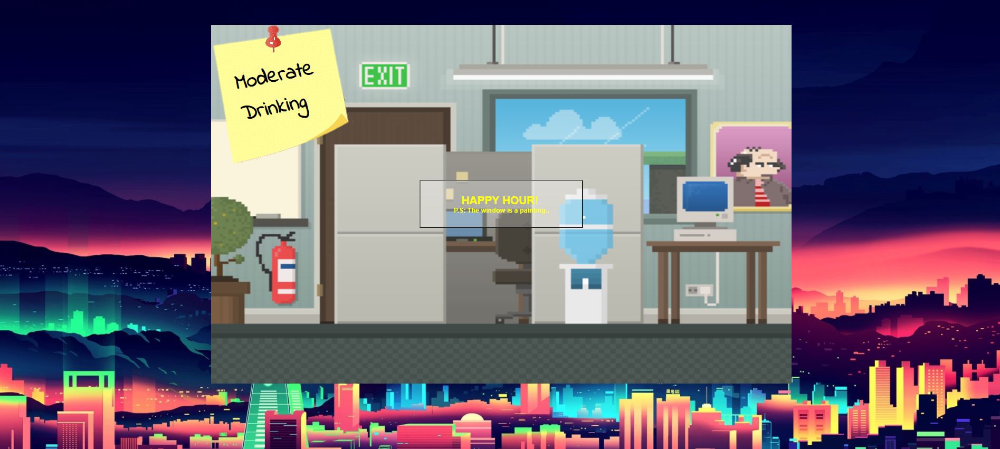
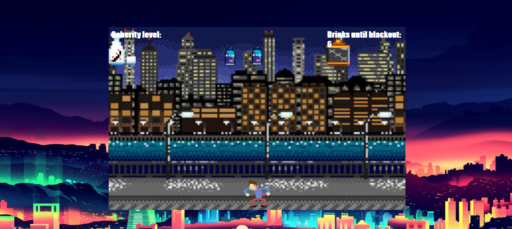
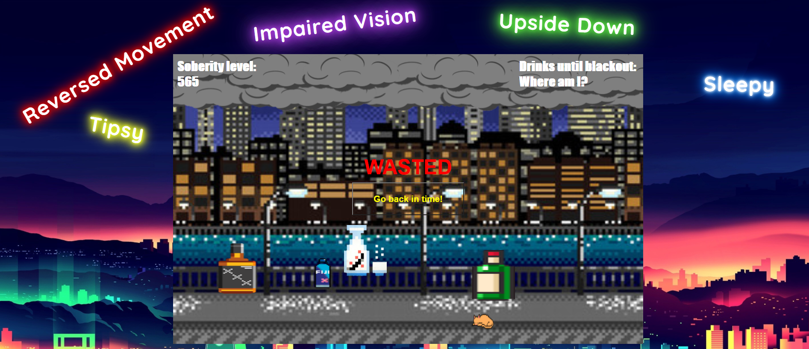

# Object Oriented Programming Game Project

# Introduction

In this world, all the drinks are life sized, you better drink your alcohol moderately and hydrate yourself with water, or else... You might turn into another being forever.

## The game

This game is called **I CAN HAZ CHEEZBURGER?!??**. In the game, you play as an anthropomorphic cheeseburger. The only thing you can do is move left or right with the arrows of your keyboard.

The goal of the game is to stay alive as long as possible by avoiding the Nyan Cats who are raining from the sky and trying to _haz_ you. The longer you stay alive, the higher your score!

At the moment, the game is a bit broken. This project will have you first fix the broken game, then add your own features to it. :)

## Instructions

1. Use Left Arrow Key or Right Arrow Key to dodge the alcoholic drinks and drink as much water as you can. Beware, your body doesn't always listen to you with a few drinks in your system.

## The Game

- Different aspect ratio with more enemy columns.
- A start menu (with a title) to launch the game with a button.
- Background music when the game is started.
- Different theme. (enemies, players, background, etc.)
- Object going down faster as the score goes up.
- Different kind of falling objects (enemies).
- A life counter.
- The gameplay changes each time we lose a life, but it gets reversed back to normal when we gain back a life. (5 changes and the name of the changes appear on top of the screen to tell the user.)
- The character is following the direction of the arrow key pressed.
- The character changes when it dies.
- A restart button to reset the game.
